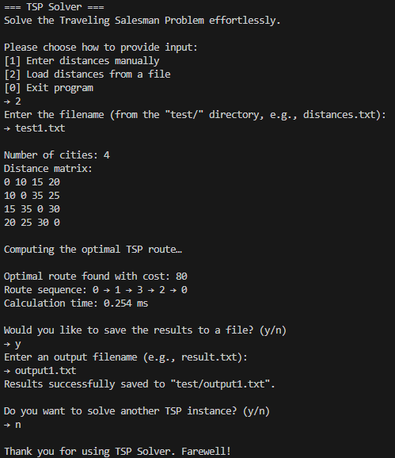

# 🚀✨ **TSP Solver (Swift)**  
[![Swift 5.9][Swift-img]][Swift-url] [![License: MIT][MIT-img]][MIT-url]

[Swift-img]: https://img.shields.io/badge/Swift-5.9-orange?style=for-the-badge  
[Swift-url]: https://swift.org/download/  
[MIT-img]: https://img.shields.io/badge/license-MIT-yellow?style=for-the-badge  
[MIT-url]: https://mit-license.org/

> A nimble CLI tool to tackle the classic **Traveling Salesman Problem** with bitmask dynamic programming, delivering quick runtimes and seamless file I/O.

---

## ✨ Quick Peek
- **Pure Swift 5.9** → zero external dependencies.  
- **Bitmask DP Engine** → solves up to ~20 cities efficiently.  
- **Dual Input Modes** → choose manual or file-based entry.  
- **Result Export** → save cost, tour, and runtime to a text file.

---

## 🗂️ Project Layout
```txt
TSP-Swift/
├─ src/
│  ├─ main.swift      # CLI interface & I/O handling
│  └─ TSP.swift       # Bitmask DP logic & path reconstruction
├─ test/              # Sample inputs & outputs
│  ├─ test1.txt       # example distance matrix
│  └─ output1.txt     # saved results example
└─ README.md          # ← you are here
```

---

## ⚙️ Requirements
| Platform      | Must-Have                          | Nice-to-Have            |
|---------------|------------------------------------|-------------------------|
| macOS/Linux   | **Swift ≥ 5.9**, **Terminal/CLI**   | Xcode (macOS), VS Code  |
| Windows (WSL) | Ubuntu 20.04+, **clang**, **libcurl**, **libssl** | —         |

1. **Swift 5.9** – install from [swift.org][Swift-url].  
2. **WSL/Linux dependencies**:
   ```bash
   sudo apt update && sudo apt install -y clang libcurl4-openssl-dev libssl-dev pkg-config
   ```
3. **Permissions** – ensure read/write on `test/` for file I/O.

---

## 🔨 Build

### macOS / Linux / WSL
```bash
cd TSP-Swift
swiftc src/main.swift src/TSP.swift -o tsp_solver
```
Produces a `tsp_solver` executable.

---

## ▶️ Run It
```bash
./tsp_solver
```
1. Choose **[1]** for manual entry or **[2]** to load a distance file.  
2. If **manual**, enter city count `n`, then `n` lines of space-separated integers.  
3. If **file**, enter a filename under `test/` (e.g., `sample1.txt`).  
4. View the computed **cost**, **tour sequence**, and **runtime**.  
5. Optionally save results by answering `y` and providing an output filename.  
6. To solve another instance, confirm with `y` when prompted.

---

## 📂 Input & Output

### File Input Format
```
n
row₀₀ row₀₁ … row₀ₙ₋₁
row₁₀ row₁₁ … row₁ₙ₋₁
…
rowₙ₋₁₀ rowₙ₋₁₁ … rowₙ₋₁ₙ₋₁
```
- **n** = number of cities  
- **rowᵢⱼ** = integer distance from city i to city j  

#### Example (`test/test1.txt`)
```
4
0 10 15 20
10 0 35 25
15 35 0 30
20 25 30 0
```

### Saving Output
- When prompted, type `y` to save.  
- Provide a filename (e.g., `result1.txt`); the tool writes under `test/`.  
- Output includes city count, matrix, cost, tour, and runtime.

```
Number of cities: 4
Distance matrix:
0 10 15 20
10 0 35 25
15 35 0 30
20 25 30 0

Optimal route cost: 80
Route sequence: 0 → 1 → 3 → 2 → 0
Calculation time: 0.243 ms
```


## 🧠 Under the Hood

### Bitmask Dynamic Programming
- **State**:  
  - `pos` → current city index.  
  - `mask` → bitmask of visited cities (`1 << i` means city i is visited).  
- **DP Table**:  
  - `dp[pos][mask]` stores the minimum cost from `pos` with visited = `mask`, covering all remaining cities and returning to 0.  
  - Dimensions: `n × 2ⁿ`.  
- **Base Case**:  
  ```swift
  if mask == (1 << n) - 1 { return dist[pos][0] }
  ```
- **Transition**:  
  For each `nextCity` not in `mask`:
  ```swift
  let newMask = mask | (1 << nextCity)
  let cost = dist[pos][nextCity] + solve(nextCity, newMask, dist)
  dp[pos][mask] = min(dp[pos][mask], cost)
  path[pos][mask] = nextCity
  ```
- **Reconstruct Tour**:  
  Start at `(pos=0, mask=1)`, follow `path[][]` until full mask, then append 0.

**Time Complexity**: `O(n² · 2ⁿ)`  
**Space Complexity**: `O(n · 2ⁿ)`

---

## 📸 Sample Screenshot


---

## 📝 License
**MIT** — because sharing is caring. See [MIT License][MIT-url] for full text.

---

## 👤 Author
**Faqih Muhammad Syuhada (13523057)**  
Informatics — Institut Teknologi Bandung  
- GitHub: [FaqihMSY](https://github.com/FaqihMSY)  
- LinkedIn: [faqihmuhammadsyuhada](https://www.linkedin.com/in/faqihmuhammadsyuhada/)  
- Email: 13523057@std.stei.itb.ac.id  

> Built with passion, bangun subuh, mie goreng 2, and a dark-themed terminal.